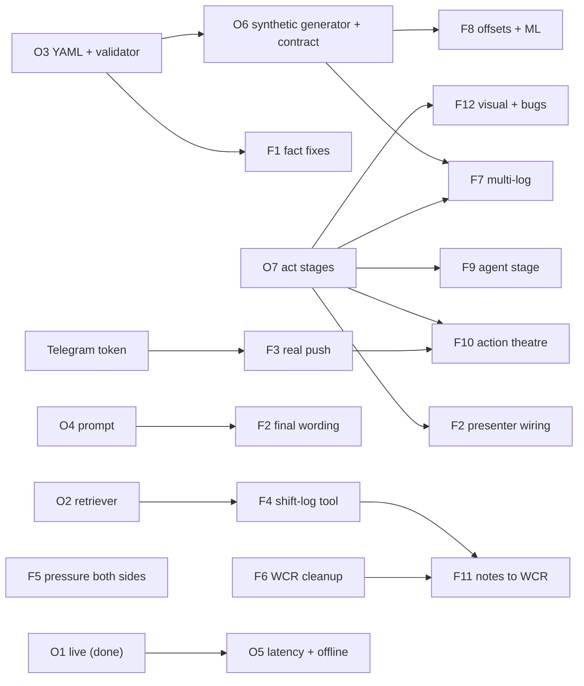

# Drilling Intelligence 2.0 — Delegation Playbook (`DELEGATION_PLAYBOOK.md` v0.5)

> **In-flight work, open bugs and the Flash queue live in [`ACTIVE_DEBUGGING_AND_EXECUTION.md`](ACTIVE_DEBUGGING_AND_EXECUTION.md).** This file stays the long-term source of truth.

> **Purpose:** split the [`checklist.md`](checklist.md) v0.5 work between **Opus** (high-value engineering + every review) and **Gemini Flash** (file-scoped execution).
> **Golden rules for Flash sessions**
> 1. Touch **only** the files listed under "Owns". If a change is needed elsewhere, stop and report it.
> 2. Numbers come **only** from `data/scenario/mn_sm_dw_01.yaml` and `offsets.yaml`. Never invent a number.
> 3. Column names come **only** from `docs/data/column_contract.md` (after O6 lands). Never invent a column.
> 4. Finish by running the package's **Verify** commands and pasting the output.
> 5. Never `git commit` or `git push`.
> 6. Bring the diff back to Opus for review before the box is ticked.

---

## 1. Who does what

### Opus packages

| Package | Checklist | Status | Waits for | Owns (files) |
|---|---|---|---|---|
| **O1** Live resilience + LIVE/SCRIPTED mode | P0-1, P0-2 | Code done · real-network verify pending (ADC) | ADC login | `backend/app/agent/live_session.py`, `frontend/src/live/liveClient.ts`, `frontend/src/state/turnMachine.ts`, `frontend/src/state/uiStore.ts` |
| **O4** Agent behaviour contract | P0-3 | Next | — | `config/prompts/agent_system_prompt.md`, `backend/app/agent/prompts.py` |
| **O3** Reservoir YAML block + hardened validator | P0-4a | Next | — | `data/scenario/mn_sm_dw_01.yaml` (`reservoir:`, `mudlog:` only — ✅ added 2026-09-26), `pipelines/synth/validate_facts.py` |
| **O6** D1-core synthetic generator + column contract + frames switch | P0-6 | Next | O3 (YAML block) | new `pipelines/synth/generate_hires_well.py`, new `docs/data/column_contract.md`, `backend/app/scenario/frames.py`, new `backend/tests/scenario/test_hires_physics.py` |
| **O7** FE-1 act-staged layouts | P0-7 | Next | — | `frontend/src/state/scenarioStore.ts` (`ACTS`), `frontend/src/components/common/ActNavBar.tsx`, `frontend/src/screens/CommandCenter/index.tsx`, new `frontend/src/screens/CommandCenter/acts.tsx`, new `frontend/src/components/common/TakeawayCard.tsx`, `frontend/src/state/presenter.ts`, `frontend/src/components/timeline/Timeline.tsx`, `frontend/src/components/common/AppHeader.tsx` |
| **O2** Real retriever + citations | P0-5 | After O6/O7 | — | `backend/app/rag/*`, `backend/app/agent/tools.py` (`search_knowledge`, `lookup_offset_events` only), `pipelines/embeddings/*` |
| **O5** Latency harness + offline run | P1-8, P1-9 | Last | O1, F2 | `scripts/rehearsal/*`, `docs/stage/latency.md` |

### Flash packages

| Package | Checklist | Independent? | Waits for | Owns (files) |
|---|---|---|---|---|
| **F6** WCR cleanup | P1-7 | **Yes — start now** | — | `frontend/src/screens/WcrViewer/WcrDocument.tsx`, `frontend/src/screens/WcrViewer/ShiftNotesTab.tsx` |
| **F5** FE-3 Pressure window: both sides | P1-2 | **Yes — start now** | — | `frontend/src/components/pressure/PressureWindow.tsx`, `frontend/src/components/pressure/GhostCurve.tsx`, `frontend/src/components/pressure/DistanceToHazard.tsx` |
| **F2** Crescendo v2 content (15 turns / 4 acts) | P1-1 | **Content yes — start drafting now** | O7 before touching `presenter.ts`; O4 for final wording | `data/scenario/turns.yaml`, `frontend/src/mocks/agentScript.ts`; *after O7:* `frontend/src/screens/PresenterConsole/index.tsx` |
| **F3** Real Telegram push | P1-3 | Yes | Bot token from owner | `backend/app/actions/push_telegram.py`, `backend/app/actions/dispatch.py`, `.env.example` |
| **F1** Fact corrections + regeneration | P0-4b | No | **O3** | `backend/app/agent/watchdog.py`, `backend/app/actions/docs_wcr.py`, `backend/app/actions/types.py`, `data/scenario/shift_notes.yaml`, `data/knowledge/source/{ddr,incidents}/*.md`, `frontend/public/mocks/shift_notes.json`, chunks, PDFs |
| **F7** FE-2 Multi-log `CompositeLog.tsx` | P0-8 | No | **O6** (column contract + data), **O7** (act slot) | new `frontend/src/components/logs/CompositeLog.tsx`, new `frontend/src/components/logs/logPatterns.ts`, one import line in `frontend/src/screens/CommandCenter/acts.tsx` |
| **F8** Offsets + lithology ML | P0-6 (offsets, ML) | No | **O6** | new `pipelines/synth/generate_offsets.py`, `pipelines/ml/train_lithology.py`, `data/processed/offsets/*`, new `backend/tests/ml/test_lithology_model.py` |
| **F4** `draft_shift_log` tool | P1-6 (tool) | No | **O2** (shares `tools.py`) | new `backend/app/agent/tool_shift_log.py`, one line in `tools.py`, one declaration in `live_session.py` |
| **F9** FE-4 Agent stage | P1-4 | No | **O7** | `frontend/src/components/agent/*` |
| **F10** FE-5 Action theatre | P1-5 | No | **O7**, F3 for the real payload | `frontend/src/components/actions/*` |
| **F11** FE-6 Shift notes ↔ WCR | P1-6 (UI) | No | **O7**, F4 | `frontend/src/screens/WcrViewer/*` (after F6) |
| **F12** FE-7 visual system + FE-8 bugs | P2 | No | **O7** | `frontend/src/design/*`, `frontend/src/screens/BasinMap/*`, `frontend/vite.config.ts` |

**Run now in parallel:** O4 → O3 → O6, and O7 (Opus) · **F6, F5, F2-draft** (Flash) · F3 as soon as the token exists.
**Then:** F7 + F8 (after O6/O7) · F1 (after O3) · O2 → F4 → F11 · F9, F10, F12 (after O7) · O5 last.

> [!IMPORTANT]
> File-ownership conflicts to respect: `presenter.ts` (O7 then F2) · `tools.py` (O2 then F4) · `acts.tsx` (O7 creates, F7 changes one import) · `WcrViewer/*` (F6 then F11).

---

## 2. Flash prompts (copy-paste)

### F6 · WCR cleanup (start now)
> Remove the third-party SAFIR-03 image block (and its caption grid) from `frontend/src/screens/WcrViewer/WcrDocument.tsx` and `frontend/src/screens/WcrViewer/ShiftNotesTab.tsx`. The image path `/img/design_references/shale_sand_limestone_lithology_log.webp` is broken and the image is another company's well; it must never ship. Keep all other content and layout.
>
> **Verify:** `cd frontend && npx tsc --noEmit -p . && npm run build` green; `grep -rn "shale_sand_limestone" frontend/src` returns nothing.

### F5 · FE-3 Pressure window: both sides (start now)
> Upgrade `frontend/src/components/pressure/PressureWindow.tsx` (you may also edit `GhostCurve.tsx` and `DistanceToHazard.tsx`) so a board member understands the "both sides" story in 3 seconds:
> 1. **Shaded kick zone**: area between the PP curve and the active MW line wherever MW < PP + 0 (red, 20 % opacity), labelled "KICK SIDE".
> 2. **Shaded loss zone**: area between ECD and the lower of FG / shoe FIT wherever ECD > that limit, and a thin amber band 0.1 ppg below it, labelled "LOSS SIDE".
> 3. Lines: PP, FG, shoe FIT (12.10), active MW, ECD, and **ML-recommended MW** (the YAML value, 11.65 ppg) as a bold dashed teal line labelled "ML recommended 11.65".
> 4. **Look-ahead band**: bit → bit + 50 m shaded light grey, labelled "next 50 m".
> 5. When bit ≥ 4,160 m, two margin callouts: "Kick margin at 4,195 m: PP − MW = X ppg" and "Loss margin: FIT − ECD = Y ppg", computed from `useScenario` data (columns `derived.PP`, `derived.FG`, `derived.FIT`, `derived.ECD`, `mud.MW_IN_PPG`, `ghost.MW_UNCHANGED`).
> 6. The "if unchanged" ghost stays and must visibly cross PP at 4,195 m.
> Numbers from data/YAML only. Labels ≥ 12 px; must read well in light and dark themes.
>
> **Verify:** `cd frontend && npm test && npm run build` green; screenshot at 4,172 m (press `3` for turn 3) shows both shaded zones, both callouts and the ML line.

### F2 · Crescendo v2 content (15 turns / 4 acts)
> Rewrite `data/scenario/turns.yaml` and `frontend/src/mocks/agentScript.ts` to the 15-turn table in `build.md` → Phase 4 → §4.C (T0, T1, T2, T3, T4a, T4b, T5, T6, T7, T8, T9, T10, T11, T12, T13). Add an `act: 1|2|3|4` field to each turn (Act 1 = T0–T3, Act 2 = T4a–T6, Act 3 = T7–T9, Act 4 = T10–T13). Each turn needs the presenter line (Hindi in Devanagari + English) and the agent reply (hi + en, max 3 sentences). Every number must come from the scenario YAMLs, including the new `reservoir:` and `mudlog:` blocks. T4a: the agent asks "kaunsa zone — U3 pay sand, 4,195 m?"; T4b gives the ETA as (4,195 − bit depth) ÷ current ROP, never a hardcoded time. Keep existing field names (`n`, `md_m`, `leader`, `mode`, `intent`, `trigger`, `tools`); use `n` = 0…14 in order and add `label: "T4a"` etc. for display. **Do not edit `presenter.ts` or `PresenterConsole` until Opus confirms O7 is merged.**
>
> **Verify:** `cd frontend && npm test && npm run build` green · `python3 pipelines/synth/validate_facts.py` exits 0 · click through all 15 turns.

### F3 · Real Telegram push (needs `TELEGRAM_BOT_TOKEN`, `TELEGRAM_CHAT_ID`)
> Implement `send_telegram_alert` in `backend/app/actions/push_telegram.py` using `httpx.AsyncClient` → `https://api.telegram.org/bot{token}/sendMessage` (Markdown). Read token/chat ID from env. If either is missing or the call fails, return `DispatchResult(status=SIMULATED)` with the formatted text — never raise. In `backend/app/actions/dispatch.py` keep chat/email simulated. Add both env vars to `.env.example`. Do not edit `tools.py`; Opus will wire `dispatch_fanout` to `dispatch_all_moc`.
>
> **Verify:** with env set, `uv run python -c "import asyncio; from app.actions.dispatch import dispatch_all_moc; from app.actions.types import MocApprovalPayload; print(asyncio.run(dispatch_all_moc(MocApprovalPayload())))"` from `backend/` delivers a message; without env it returns SIMULATED.

### F1 · Fact corrections + regeneration (after O3 lands)
> You are editing the Drilling Intelligence 2.0 repo. Canonical numbers live ONLY in `data/scenario/mn_sm_dw_01.yaml` and `data/scenario/offsets.yaml`. Fix these drifted values wherever they appear in the files you own: MN-DW-02 kick gain must be **12 bbl** (not 18); memo ID must be **MEMO-SM-2026-09** (replace every `MOC-MN-SM-DW-01-003`); barite must be **28.3 lb/bbl** and volume gain **60 bbl** (not 22.4 / 26); connection gas at the 4,172 m warning must be **0.4 → 1.1 %** (not 0.8→2.4 or 0.8→3.2); DT departure must be **+10 µs/ft** (not +12); sand-top overbalance must be **120 psi** (not 122). Reservoir claims must match the new `reservoir:` block (e.g. "75 m gross gas column"). Files you own: `backend/app/agent/watchdog.py`, `backend/app/actions/docs_wcr.py`, `backend/app/actions/types.py`, `data/scenario/shift_notes.yaml`, `data/knowledge/source/ddr/*.md`, `data/knowledge/source/incidents/*.md`. Then regenerate: `frontend/public/mocks/shift_notes.json` from the YAML, re-run the chunker to refresh `data/knowledge/chunks/corpus_chunks.json`, and re-render PDFs with `uv run --with reportlab,pyyaml python pipelines/synth/render_pdfs.py`. Do not touch any other file.
>
> **Verify:** `python3 pipelines/synth/validate_facts.py` exits 0 · `grep -rn "18 bbl\|MOC-MN-SM-DW-01-003\|22\.4\|2\.4%\|3\.2%" backend data frontend/src` returns nothing.

### F7 · FE-2 Multi-log `CompositeLog.tsx` (after O6 + O7)
> Build `frontend/src/components/logs/CompositeLog.tsx` — a SAFIR-03-style composite log (design reference: `docs/design/inspiration/sample_interpreted_logs/shale_sand_limestone_lithology_log.webp`; reference only, never import it). Use ONLY column names from `docs/data/column_contract.md`; read data via `useScenario` (`data`, `md`) and render only samples ≤ bit depth, except tops (full). Put fill patterns in `logPatterns.ts`.
> Layout (left → right), with a two-row header: row 1 band titles **"INPUT · raw LWD at the bit"**, **"OUTPUT · ML inversion (instant)"**, **"LAG · what the mudlogger sees"**; row 2 per-track curve names + scales, exactly like the reference.
> - ① GR (0–150 API, green) / CALI + BIT (6–16 in) / SP · ② depth ruler (m) · ③ formation tops U1–U4 as coloured blocks with IDs
> - ④ RHOB (1.95–2.95 g/cc, red) / NPHI (0.45–−0.15, green, reversed) / PEF (0–20, black), **yellow fill where NPHI < RHOB-equivalent (sand/gas crossover)**
> - ⑤ RDEP / RMED / RSHAL on log scale 0.2–2000 Ω·m (red dashed / blue dotted / grey)
> - ⑥ SW + SXO (1–0) with the **GWC** horizontal line + label from the YAML `reservoir.gwc_m`
> - ⑦ PHIE (0.5–0) with fills: residual HC (green), movable HC (yellow), water (white/transparent) using the contract's BVW / SXO columns
> - ⑧ Lithology 0–100 % cumulative stacked fill with patterns: shale (green dashes), siltstone (tan dots), sandstone (yellow + black dots), limestone (blue brick)
> - ⑨ Mudlog lithology from cuttings, drawn only down to `bit − lag_m`, where `lag_m = current ROP (m/hr) × mudlog.bottoms_up_lag_min / 60`; between there and the bit, a hatched grey band labelled "cuttings in transit · +45 min" (value from YAML)
> Board mode (`useUi().mode === 'board'`) shows ①④⑤ ‖ ⑦⑧ ‖ ⑨; engineer mode shows all nine. No horizontal cut-off at 1920×1080 in the act-1 slot; header text ≥ 12 px; no overlapping labels. Plotly (existing `lib/Plot`) with `fillpattern` is fine; so is SVG. Finally change the single import in `frontend/src/screens/CommandCenter/acts.tsx` from `LogTracks` to `CompositeLog`.
>
> **Verify:** `cd frontend && npx tsc --noEmit -p . && npm test && npm run build` green · screenshots at bit 4,150 m (ML column reaches the bit, mudlog stops ≈ 16.5 m above at 22 m/hr) and 4,300 m (crossover + GWC at 4,270 m visible) saved to `docs/stage/acts/` for Opus review.

### F8 · Offsets + lithology ML (after O6)
> 1. Create `pipelines/synth/generate_offsets.py` that imports the generator from `pipelines/synth/generate_hires_well.py` and produces MN-DW-01, MN-DW-02 and MN-DW-03 using the per-well parameters in `data/scenario/offsets.yaml` (depth shift, sand thickness, pressure ramp, events: MN-DW-02 kick at 4,195 m, MN-DW-03 losses at 4,222 m). Write `data/processed/offsets/<well>.parquet` with the same columns as the contract, plus a truth label `label.litho`.
> 2. Rewrite `pipelines/ml/train_lithology.py`: train a gradient-boosted classifier (scikit-learn `HistGradientBoostingClassifier`; no new heavy deps) on MN-DW-01 + MN-DW-03 inputs (GR, RHOB, NPHI, PEF, DT, RDEP, RMED — no labels or outputs as features), hold out MN-DW-02, then infer on the live well and write `ml.litho.class`, `ml.litho.probs.*`, `vol.*` back through the path documented in the column contract. Save `models/lithology/metrics.json` (held-out accuracy, confusion matrix).
> 3. Add `backend/tests/ml/test_lithology_model.py` asserting held-out accuracy ≥ 0.85 and that probabilities sum to 1.
>
> **Verify:** `~/.local/bin/uv run --with pytest,fastapi,httpx,pyyaml,numpy,pandas,pyarrow,pydantic,scikit-learn pytest backend/tests` green; paste `metrics.json`.

### F4 · `draft_shift_log` tool (after O2 merged)
> Create `backend/app/agent/tool_shift_log.py` with `draft_shift_log(shift_id: str | None = None) -> dict` that reads `data/scenario/shift_notes.yaml` via `app.scenario.facts.shift_notes()` and returns the latest (or requested) shift as a structured draft: header, depth range, MW in/out, ECD, operations, handover notes, and citations `[shift_id]`. Register it in `execute_tool` in `tools.py` (one line) and add its declaration to `FUNCTION_DECLARATIONS_DATA` in `live_session.py`. Add a pytest in `backend/tests/agent/test_shift_log.py`.
>
> **Verify:** `uv run --with pytest,fastapi,httpx,pyyaml,numpy,pandas,pyarrow,pydantic pytest backend/tests` green.

### F9 · FE-4 Agent stage (after O7)
> In `frontend/src/components/agent/*`: (1) captions large (agent ≥ 20 px in board mode), Hindi first, English secondary smaller; (2) render `tool_call` running/done events as human-readable reasoning steps (map tool names to Hinglish phrases, e.g. `lookup_offset_events` → "Paas ke wells ka record dekh raha hoon…"); (3) citation cards show `doc_id` + section from the message's `citations`; (4) when an agent message ends with "?", highlight it as a clarifying question. Do not change `liveClient.ts` or stores.
>
> **Verify:** build green; SCRIPTED turn 6 shows ≥ 1 reasoning step and ≥ 1 citation card.

### F10 · FE-5 Action theatre (after O7; real payload after F3)
> In `frontend/src/components/actions/*`: present memo → approval → fan-out as one left-to-right sequence for the Act 3 stage (`ActionTheatre.tsx`, exported default). Reuse `MemoOverlay`, `ApprovalRail`, `DispatchCard`, `PhoneMirror` content. The phone mirror shows the exact Telegram text and a delivered tick when the DISPATCH ledger entry's channel is `delivered`. Read state only from `useLedger` / `useScenario`.
>
> **Verify:** build green; SCRIPTED turns 7→9 show all four steps in order within 10 s of approval.

### F11 · FE-6 Shift notes ↔ WCR (after O7, F4, F6)
> In `frontend/src/screens/WcrViewer/*`: side-by-side layout, shift notes left and WCR draft right; each WCR paragraph carries `source_ids` and clicking it highlights the matching notes. Data from `shift_notes.json` and the WCR payload.
>
> **Verify:** build green; clicking a WCR paragraph highlights ≥ 1 note.

### F12 · FE-7 visual system + FE-8 bugs (after O7)
> (1) Make the light executive theme the default (`uiStore` default stays toggleable; edit tokens/CSS in `frontend/src/design/*` only); board-mode minimum font 14 px; remove label truncation at 1920×1080. (2) Basin map: fix overlapping well labels (offset/collision), and show a clean static fallback when no Maps key. (3) `vite.config.ts`: `manualChunks` so Plotly and three.js load lazily; target main chunk < 1.5 MB.
>
> **Verify:** build green, main chunk size printed; screenshots of `/` and each act at 1920×1080.

---

## 3. Review protocol (Opus)
1. Read the diff against the package's "Owns" list; reject edits outside it.
2. Re-run the Verify commands myself.
3. Run the hardened validator.
4. For UI packages: take a 1920×1080 screenshot and compare against the spec / reference.
5. Tick the checklist box only after 1–4 pass.
