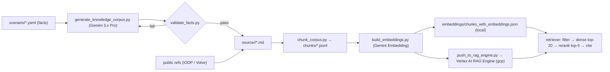

# `data/knowledge/` — RAG Institutional Memory

Implements [SDD §9](../../docs/SDD.md). It holds the older reports, SOPs, incident reports and DDRs, and it is where the embeddings are built.



## Folder map

| Path | What |
| :--- | :--- |
| `source/sops/` | 6 SOPs (`ONGC-*-SOP-*`, illustrative) |
| `source/wcr/` | Offset WCRs: MN-DW-01, MN-DW-02, MN-DW-03, MH-112 |
| `source/incidents/` | Incident reports (kick 4,195 m, losses 4,222 m, shallow gas, stuck pipe, ballooning, SOBM gas-solubility near-miss) |
| `source/ddr/` | ~60 Daily Drilling Reports around the offset events |
| `source/mud_programs/` | Planned vs. actual mud programs per offset |
| `source/lessons_learned/` | Cross-well lessons register (+ write-backs at TD) |
| `source/legacy_scans/` | Handwritten-style legacy DDR image(s) for the multimodal beat |
| `source/public_reference/` | Optional public text (IODP proceedings chapters, Volve DDRs) |
| `rendered/` | Optional PDF renditions (for realism on screen) |
| `chunks/` | `*.jsonl` chunk files (`Chunk` contract, without embeddings) |
| `embeddings/` | `chunks_with_embeddings.json`, `index.npy`, `manifest.json` |
| `eval/` | `qa_pairs.yaml` (English + Hindi queries with expected doc / page) |

## Document template (front-matter = `KnowledgeDoc` contract)

```markdown
---
doc_id: INC-MN-DW-02-KICK-4195
doc_type: INCIDENT
title: "Gas Kick at 4,195 m — Top Miocene Channel Sand"
well_id: MN-DW-02
md_range: [4190, 4200]
date: "2024-03-14"
authoring: synthetic
licence: "illustrative"
tags: [kick, narrow-window, sand-top, SOBM]
version: "1.0"
---
<!-- page: 1 -->
# 1. Summary
...
<!-- page: 2 -->
# 2. Sequence of Events
...
```

## Embedding settings (defaults, see `config/settings.*.yaml`)
- Model: **Gemini Embedding** (`gemini-embedding-001`, or the latest GA). Dim 768.
- Task types: `RETRIEVAL_DOCUMENT` (chunks) and `RETRIEVAL_QUERY` (queries).
- Chunking: section-aware, 600–800 tokens, 100 overlap, tables kept whole.
- Re-embed when `manifest.json` → `embedding_model` or `chunker_version` changes.
