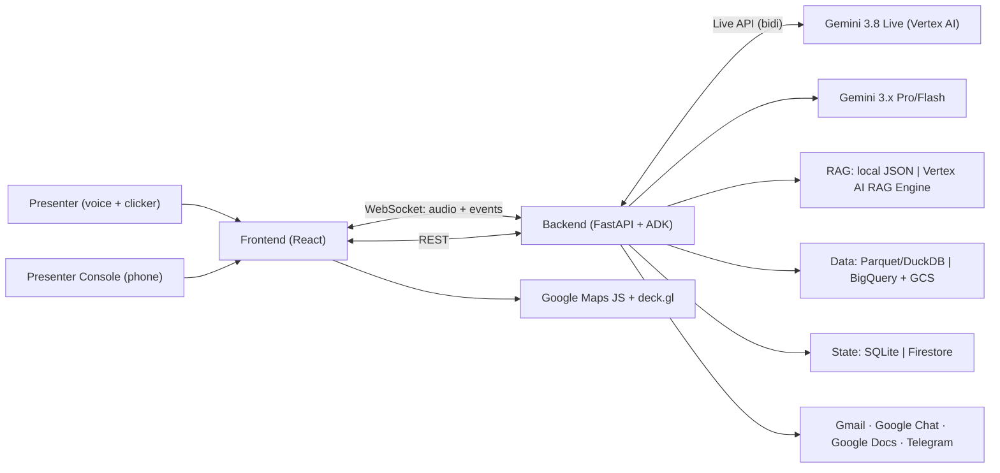
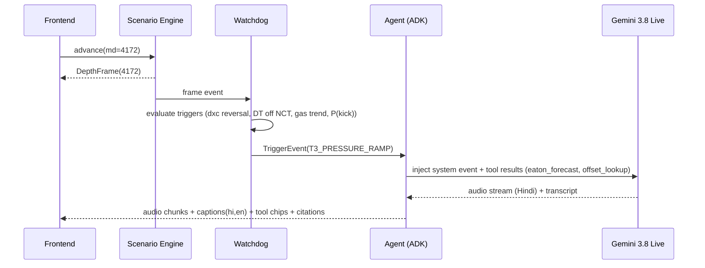
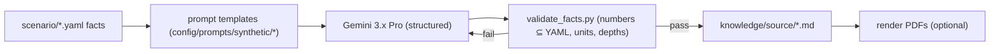
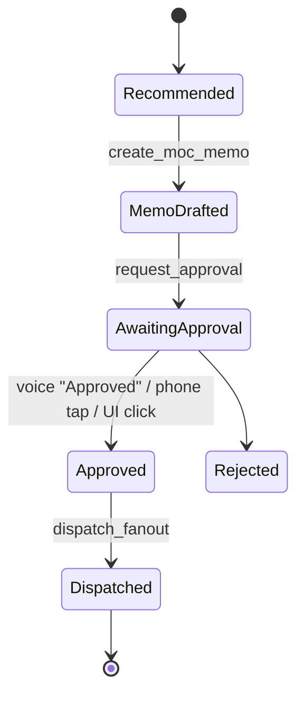

# Drilling Intelligence 2.0 — Software Design Document (SDD)

| Field | Value |
| :--- | :--- |
| **Document** | `docs/SDD.md` · v1.0 |
| **Status** | Approved baseline. Changes go through §19 (Change Control) |
| **Owner** | amandeepsinghs |
| **Companion docs** | [`../brief.md`](../brief.md) (narrative, numbers), [`../build.md`](../build.md) (build steps), [`../checklist.md`](../checklist.md) (progress), [`../verbatim.md`](../verbatim.md) (original intent) |
| **Audience** | Builders (human and agent). Every implementation decision must trace back to a section here |

---

## 1. Purpose & Scope

### 1.1 Purpose
Build a **board-grade, live, voice-driven drilling co-pilot demo** for the ONGC Executive Board session on *AI in E&P*. It must show four AI layers working together on one deepwater well story:
1. Language and voice.
2. Physics and ML.
3. Institutional memory (RAG).
4. Closed-loop agentic action.

### 1.2 In Scope
- A single live well, `MN-SM-DW-01` (illustrative Mahanadi deepwater), driven by a **deterministic Scenario Engine**.
- Two screens (Basin Map, Command Center), three overlays (Memo/Approval, WCR, Audit), and a Presenter Console.
- A bilingual (Hindi/English) voice agent on **Gemini 3.8 Live**, with **proactive** interruptions.
- A RAG knowledge base over a synthetic, fact-validated corpus, with optional public enrichment.
- Actions: MOC memo, approval, fan-out (Chemist, RTOC, Email, Telegram, Google Chat), Google Doc WCR, Decision Ledger.
- **Local-first** operation, promotable to **GCP** (`asia-south1`) through adapters.

### 1.3 Out of Scope
- Real-time WITSML ingestion from a live rig.
- Multi-well fleet operations.
- User management and auth beyond a presenter PIN.
- Production-grade ML accuracy claims beyond the reported hold-out metrics.
- Any real ONGC data (reserved for the pilot).

### 1.4 Design Tenets (in priority order)
1. **Never wrong on stage.** Every number comes from the Scenario / Physics engine through tools. The LLM never invents values.
2. **Honest by construction.** Every figure carries provenance, and synthetic data is labelled as synthetic.
3. **Human in the loop.** Safety-critical actions require a named approval and are ledgered.
4. **Premium, calm UI.** "Mission control, not sci-fi" (brief §13).
5. **Data-later.** The UI and agent depend only on **contracts**, never on a specific data source.
6. **Local-first, cloud-ready.** Every I/O runs through an adapter with `local` and `gcp` implementations.
7. **Rehearsable.** Deterministic turns, hotkeys, snapshots and offline fallback.

---

## 2. Success Criteria

| ID | Criterion | Target |
| :--- | :--- | :--- |
| SC-1 | Voice turn latency (end of speech → first audio) | **≤ 1.5 s** p90 on venue network |
| SC-2 | Numeric correctness (spoken / displayed vs. Scenario Engine) | **100%** (automated check in rehearsal mode) |
| SC-3 | Proactive alerts fire at 4,172 / 4,195 / 4,205 m | **3/3**, every run |
| SC-4 | Full 10-turn run without manual recovery | **≥ 5 consecutive rehearsals** |
| SC-5 | RAG answers cite the correct doc and page | **≥ 95%** on the eval set (§9.8) |
| SC-6 | Offline mode runs the full story with no network | Pass |
| SC-7 | UI renders at 60 fps at 1920×1080 on the demo laptop | Pass (Plotly WebGL) |
| SC-8 | Hindi caption accuracy (presenter lines) | **≥ 95%** word accuracy on the scripted lines |

---

## 3. System Context



---

## 4. Architecture

### 4.1 Logical Components

| Component | Responsibility | Location |
| :--- | :--- | :--- |
| **Scenario Engine** | Owns the canonical well state per depth. Advances depth. Evaluates triggers. Serves turn snapshots | `backend/app/scenario/` |
| **Physics Engine** | Eaton PP (+ centroid), Matthews-Kelly FG + FIT, ECD hydraulics, barite, unit conversion | `backend/app/physics/` |
| **ML Services** | Lithology classifier, kick/loss probability, ROP optimiser, SHAP | `backend/app/ml/` |
| **RAG Service** | Ingest, chunk, embed, index, retrieve, cite, write back | `backend/app/rag/` |
| **Agent Service** | Live session proxy, tools, watchdog, prompts, captions, guardrails | `backend/app/agent/` |
| **Action Service** | Memo, approval, dispatch fan-out, WCR, ledger | `backend/app/actions/` |
| **Adapters** | Storage, tabular, vector, state and messaging, each with `local` and `gcp` implementations | `backend/app/adapters/` |
| **API Layer** | REST and WebSocket endpoints | `backend/app/api/` |
| **Frontend** | Screens, components, Live client, state, design system | `frontend/src/` |
| **Pipelines** | Offline jobs: download, ingest, synth, embed, train, load to GCP | `pipelines/` |

### 4.2 Deployment Modes (`DI_ENV`)

| Concern | `local` (default) | `gcp` |
| :--- | :--- | :--- |
| Raw files | `data/raw/` | `gs://di2-raw-<project>/` |
| Tabular stores (4 DBs) | Parquet in `data/processed/` + **DuckDB** | **BigQuery** dataset `drilling_intel` |
| Vector index | `data/knowledge/embeddings/chunks_with_embeddings.json` + NumPy | **Vertex AI RAG Engine** corpus `di2-knowledge` |
| Live state / ledger / presenter sync | **SQLite** `data/state/di2.sqlite` + in-process pub/sub | **Firestore** (native mode) |
| Secrets | `.env` | **Secret Manager** |
| Hosting | `uvicorn` + `vite dev` / `docker compose` | **Cloud Run** (backend + static frontend), `asia-south1` |
| LLM / Live | Vertex AI (online), or **offline cache** (`DI_OFFLINE=1`) | Vertex AI |

Adapters are selected in `backend/app/core/config.py` from `config/settings.<env>.yaml`.

### 4.3 Runtime Sequence (Turn 3: proactive alert)



---

## 5. Data Architecture

### 5.1 Layers

```
raw/         immutable downloads (LAS/DLIS/zip/PDF)          ← never edited
interim/     normalised curves (units, mnemonics, depth ref)  ← loaders
processed/   DepthFrames + 4 logical stores (Parquet)         ← serving layer
knowledge/   corpus source → chunks → embeddings              ← RAG
scenario/    canonical facts (YAML)                           ← single source of truth
state/       runtime state, ledger (SQLite)                   ← runtime only
exports/     memos, WCR drafts, ledger dumps                  ← artefacts
```

### 5.2 Canonical Scenario Facts
`data/scenario/mn_sm_dw_01.yaml` holds **every number in brief §3C**: well geometry, the casing/FIT, stratigraphy, the pressure profile, the mud system, barite, triggers and KPIs. `offsets.yaml` holds the offset wells and incidents, and `turns.yaml` holds the 11 turns (depth, leader, trigger, expected tools, snapshot ID).
**Rule:** the synthetic corpus, stub curves, agent prompts and UI all read from these files. A number that is not in YAML must not appear anywhere.

### 5.3 Contracts (`data/contracts/*.schema.json`, JSON Schema 2020-12)

| Contract | Key fields |
| :--- | :--- |
| `DepthFrame` | `well_id, md_m, tvd_m, t_rel_s, curves{GR,RDEP,RMED,RHOB,NPHI,DT,PEF,CALI}, drilling{ROP,WOB,RPM,TORQUE,SPP,HKLD,FLOW_IN,FLOW_OUT,DXC}, mudlog{GAS_TOTAL,C1..C5,CONN_GAS}, mud{MW_IN_PPG,MW_OUT_PPG,PV,YP,PIT_VOL_BBL}, derived{OBG,PP,FG,FIT,ECD,OVERBAL_PSI,ECD_FIT_MARGIN}, ml{litho{class,probs},p_kick,p_loss,rop_max}, provenance{<field>:label}` |
| `CurveManifest` | Source dataset, hole, original mnemonic → canonical mnemonic, units, depth shift, licence |
| `Event` | `event_id, type (TRIGGER\|ACTION\|APPROVAL\|DISPATCH\|NOTE), md_m, ts, payload, provenance` |
| `KnowledgeDoc` | `doc_id, doc_type (SOP\|WCR\|INCIDENT\|DDR\|MUD_PROGRAM\|LESSON\|PUBLIC_REF\|LEGACY_SCAN), title, well_id?, md_range?, date, authoring (synthetic\|public), source_uri, licence, version` |
| `Chunk` | `chunk_id, doc_id, section_path, page, text, tokens, md_range?, tags[], embedding[]?, embedding_model` |
| `Action` | `action_id, kind (MEMO\|DISPATCH\|WCR\|WRITEBACK), status, approver?, basis_snapshot_id, channel_results[]` |
| `Provenance` | enum: `MEASURED, DERIVED, SIMULATED, ASSUMED, PUBLIC, SYNTHETIC, MODEL_INFERENCE, NOT_RECORDED` |

### 5.4 Four Logical Operational Stores

| Store | Local file(s) | BigQuery table |
| :--- | :--- | :--- |
| `db_lwd_logs` | `processed/lwd/mn_sm_dw_01.parquet` | `drilling_intel.lwd_logs` |
| `db_drilling_mudlog` | `processed/mudlog/mn_sm_dw_01.parquet` | `drilling_intel.drilling_mudlog` |
| `db_mud_chemistry` | `processed/mud_chemistry/mn_sm_dw_01.parquet` | `drilling_intel.mud_chemistry` |
| `db_rag` | `knowledge/embeddings/chunks_with_embeddings.json` | RAG Engine corpus + `drilling_intel.rag_chunks` (metadata mirror) |

The frames table `processed/depth_frames/mn_sm_dw_01.parquet` is the joined serving view.

### 5.5 Data Sources & Real-Data Drop-In
- **Sources:** see `data/sources.yaml` and `build.md` §3. The primary live-well analog is **IODP 348 C0002P** (CC0).
- **Drop-in path:**
  1. `pipelines/ingest/las_to_depth_frames.py` maps real curves to canonical mnemonics.
  2. Depth is registered to the §3 interval (affine shift and optional stretch, recorded in `CurveManifest`).
  3. Curves are written into `DepthFrame.curves` with `provenance=PUBLIC`.
  4. The physics layer recomputes `derived`.
  5. The Scenario Engine **overlays** the scenario-critical signatures (e.g., the DT ramp in the transition zone) only if the real curve lacks them. Overlaid fields are flagged `SIMULATED`.
- **Invariant:** public curve values are never edited in place. Overlays are separate, labelled fields.

### 5.6 Stub Data (works before any download)
`pipelines/synth/generate_stub_frames.py` produces deterministic frames at 0.5 m from 4,000 to 4,460 m. It uses band-limited noise seeded from a well ID and follows the YAML stratigraphy and pressure profile. Every stub field is marked `provenance=SYNTHETIC`.

---

## 6. Scenario Engine

- **State:** current `md_m`, the mud state, the ROP setpoint, approvals, and fired triggers.
- **Advance modes:** `step(Δmd)`, `goto(md)`, `goto_turn(n)` (loads a snapshot), and `play(rate)` (time-compressed).
- **Triggers** (`scenario/triggers.py`, thresholds live in YAML):

| ID | Depth | Condition | Effect |
| :--- | :--- | :--- | :--- |
| `T3_PRESSURE_RAMP` | 4,172 m | dxc reversal ∧ DT > NCT + 10 µs/ft ∧ conn gas ≥ 1.0% ∧ P(kick @ current MW) ≥ 0.6 | Proactive alert, ghost curve on, distance-to-hazard on |
| `T8_OFFSET_DEPTH` | 4,195 m | md ≥ offset kick depth ∧ approved MW active | Proactive reassurance, ghost kick replay |
| `T9_DRILLING_BREAK` | 4,205 m | ROP jump ≥ 40% ∧ ECD_FIT_margin ≤ 0.10 ppg | Proactive loss-side warning |
| `SAFETY_UNDERBAL` | any | static MW < PP ∧ (flow-out Δ > 0 ∨ pit gain > 5 bbl) | Agent must say **"pumps off, flow check"** first |

- **Snapshots:** `data/scenario/snapshots/turn_XX.json`, used by the hotkeys and for rehearsal reset.
- **Clock:** the time-compression factor is shown in the UI when active (e.g., "weight-up ≈ 3 h, compressed").

---

## 7. Physics Engine (`backend/app/physics/`)

All functions are pure and unit-tested against hand calculations from brief §3.

| Module | Function | Formula / Method |
| :--- | :--- | :--- |
| `units.py` | `ppg_to_sg`, `sg_to_ppg`, `ppg_to_psi(ppg, tvd_m)` | SG = ppg / 8.345. psi = 0.052 × ppg × TVD_ft |
| `overburden.py` | `obg_ppg(tvd, water_depth, air_gap, rho_profile)` | Integrate water + sediment density → EMW |
| `eaton.py` | `pp_eaton_sonic(obg, pn, dt_n, dt, n=3.0)` | PP = OBG − (OBG − Pn)·(Δt_n/Δt)^n |
| | `pp_eaton_res(obg, pn, r, r_n, n=1.2)` | PP = OBG − (OBG − Pn)·(R/R_n)^n |
| | `centroid_sand_pp(shale_pp_at_centroid, sand_top, centroid, gas_grad)` | Lateral transfer + buoyancy |
| `fracture.py` | `fg_matthews_kelly(obg, pp, ki)` | FG = Ki·(OBG − PP) + PP |
| | `loss_limit(fg, fit_at_shoe)` | `min(fg_at_weak_point, FIT)` |
| `ecd.py` | `ecd(mw, pv, yp, gpm, rop, hole_d, pipe_od, tvd, cuttings_model)` | Bingham annular loss + cuttings-loading term |
| `barite.py` | `barite_lb_per_bbl(w1, w2)`, `barite_total(w1, w2, vol_bbl)`, `volume_gain_bbl` | 1470·(W2−W1)/(35−W2) per 100 bbl (100-lb sacks) |
| `dxc.py` | `d_exponent`, `dxc(normal_mw, ecd)` | Jorden & Shirley, corrected |

**Acceptance values** (from brief §3C):
- OBG ≈ 14.0 ppg at 4,195 m.
- Barite ≈ 28.3 lb/bbl, giving ≈ 39.8 MT for 3,100 bbl.
- Overbalance: −200 psi at 11.20 ppg, +120 psi at 11.65 ppg.
- ECD 11.84 / 12.02 / 11.86 under the scenario inputs. The ECD model is calibrated to hit these values.

---

## 8. ML Services (`backend/app/ml/`)

| Model | Algorithm | Training data | Features | Output | Metric shown |
| :--- | :--- | :--- | :--- | :--- | :--- |
| Lithology | XGBoost (RF baseline) | FORCE 2020 (+ IODP labels if available) | GR, RDEP, RHOB, NPHI, DT, PEF, (ROP) | class + probs | Hold-out macro-F1, confusion matrix |
| Kick/Loss risk | Gradient boosting + isolation-forest residual | Synthetic event library from offsets + scenario (labelled SIMULATED) | flow-out Δ, pit Δ, SPP Δ, conn gas, dxc trend, ECD margin, overbalance | `p_kick`, `p_loss` over the next 30 m | ROC-AUC on synthetic hold-out (disclosed) |
| ROP optimiser | Constrained search over the ECD model | Physics | ROP, GPM, MW, lithology | `rop_max` s.t. ECD ≤ FIT − 0.2 | n/a (physics) |
| Explainability | SHAP (TreeExplainer) | n/a | n/a | top-k drivers per prediction | Shown in the audit drawer |

- **Phase-1 behaviour:** the models are **stubs** returning scenario values from YAML (`provenance=MODEL_INFERENCE (stub)`). The interfaces are frozen now.
- **Artefacts:** `data/models/<model>/<version>/` (local) or GCS `models/` (gcp). A model card goes with each.

---

## 9. RAG Architecture

### 9.1 Corpus

| Doc type | Count (target) | Authoring | Examples |
| :--- | :--- | :--- | :--- |
| SOP | 6 | Synthetic | SM-SOP-04 narrow window, MC-SOP-02 weight-up, MOC-SOP-07, WCR-SOP-09, WC-SOP-01 flow check / shut-in, HC-SOP-05 hole cleaning |
| WCR (offsets) | 4 | Synthetic | MN-DW-01 (clean), MN-DW-02 (kick), MN-DW-03 (losses), MH-112 (carbonate) |
| Incident reports | 6 | Synthetic | Kick 4,195 m; losses 4,222 m; shallow gas; stuck pipe; ballooning; SOBM gas-solubility near-miss |
| DDRs | ~60 (20 per offset) | Synthetic | Daily ops narratives around the events |
| Mud programs | 3 | Synthetic | Planned vs. actual MW per section |
| Lessons learned | 5 | Synthetic | Cross-well lessons register |
| Legacy scan | 1–3 images | Synthetic (handwritten style) | 1990s-style DDR page |
| Public reference | optional | Public | IODP 348 / 353 operations chapters, Volve DDRs |

### 9.2 Document Format
Markdown with YAML front-matter matching `KnowledgeDoc`, stored in `data/knowledge/source/<type>/<doc_id>.md`. Pages are marked with `<!-- page: N -->` so citations can carry a page number. The PDF renditions (for realism) are generated into `data/knowledge/rendered/`.

### 9.3 Synthetic Generation Pipeline



`validate_facts.py` extracts every number and unit from each document and checks it against the YAML whitelist within tolerance. Unknown numbers fail the build.

### 9.4 Chunking
- Section-aware: split on headings, then pack to **~600–800 tokens**, with a **100-token overlap**.
- Tables are kept whole.
- Each chunk carries `section_path`, `page`, `md_range` and `tags`.

### 9.5 Embeddings
- **Model:** Vertex AI **Gemini Embedding** (latest GA; default `gemini-embedding-001`), `task_type=RETRIEVAL_DOCUMENT` for chunks and `RETRIEVAL_QUERY` for queries. The dimension is configurable (default 768).
- **Local store:** `chunks_with_embeddings.json` (a list of `Chunk` objects with the embedding). A NumPy matrix is cached at `embeddings/index.npy`.
- **Re-embedding:** triggered when `embedding_model` or the chunker version changes. A manifest hash is kept in `embeddings/manifest.json`.

### 9.6 Retrieval
1. **Metadata pre-filter:** `well_id ∈ offsets ∪ {current}`, `doc_type`, `md_range` overlapping the current md ± 50 m.
2. **Dense top-k = 20** (cosine locally, or RAG Engine).
3. **Rerank:** Vertex AI Ranking API (gcp), or a lexical+dense blend (local), keeping the top 5.
4. **Answer:** Gemini is grounded with the chunks and **must cite** `doc_id § section, p. N`.

### 9.7 Write-Back
At TD, `rag/writeback.py` creates a `LESSON` doc from the Decision Ledger and the WCR. It then runs the validator, chunks, embeds, and upserts the chunks into the index. The UI shows the new `chunk_id`.

### 9.8 Evaluation
`pipelines/embeddings/eval_rag.py` runs 30 Q/A pairs (English + Hindi queries) with the expected `doc_id` and page. It reports recall@5 and citation accuracy (target SC-5).

---

## 10. Agent Design

### 10.1 Models

| Use | Model | Mode |
| :--- | :--- | :--- |
| Conversation (voice) | **Gemini 3.8 Live** (Vertex AI) | Bidi audio, async function calling, auto language |
| Deep reasoning (optional) | Gemini 3.8 Live Extended Thinking | Only Turn 5, if latency allows |
| Memo / WCR / synthesis | Gemini 3.x Pro (latest GA) | Structured JSON |
| Fast text | Gemini 3.x Flash (latest GA) | Turn 0 typed and captions translation |
| Fallback voice | Cloud STT / TTS **Chirp 3** (hi-IN) | Only if Live fails |

Model IDs are pinned in `config/settings.*.yaml → models.*`. They are verified at build time.

### 10.2 Orchestration
**ADK** agent with bidi-streaming. The backend proxies the browser audio over WebSocket (credentials never reach the browser). One root agent is used, with tools. There are no sub-agents on stage, to keep latency down.

### 10.3 Tool Catalogue (`backend/app/agent/tools.py`)

| Tool | Input | Output | Source |
| :--- | :--- | :--- | :--- |
| `get_well_status` | — | current DepthFrame summary (ppg + SG) | Scenario |
| `get_lithology` | md? | class, probs, SHAP top-3 | ML |
| `forecast_pore_pressure` | lookahead_m | PP profile, depth to ramp, overbalance at target | Physics |
| `compute_ecd` | mw?, rop?, gpm? | ECD, margin to FIT | Physics |
| `compute_barite` | w1, w2 | lb/bbl, MT, bags, volume gain | Physics |
| `search_knowledge` | query, filters | top chunks + citations | RAG |
| `lookup_offset_events` | md_range | offset incidents | Scenario YAML + RAG |
| `create_moc_memo` | recommendation | memo_id, rendered memo | Actions |
| `request_approval` | memo_id | status (awaits UI / phone / voice "Approved") | Actions |
| `dispatch_fanout` | memo_id, channels[] | per-channel result IDs | Actions |
| `set_rop_cap` | rop | new ECD | Scenario |
| `generate_wcr` | — | doc_id, Google Doc URL | Actions |
| `writeback_lessons` | — | new chunk IDs | RAG |

### 10.4 Prompting
- **System prompt:** `config/prompts/agent_system_prompt.md`. It sets the bilingual persona (respectful Hinglish, "Sir"), the **numbers-only-from-tools rule**, the well-control rule (flow check first when underbalanced with indicators), the approval rule, brevity (≤ 3 sentences unless asked), and the citation format.
- **Proactive events:** the watchdog injects `SYSTEM_EVENT{trigger_id, facts}`. The agent must speak first, concisely, and end with a recommendation or question.

### 10.5 Captions
The Live transcript supplies Hindi (Devanagari normalised). The English line comes from Gemini Flash translation (streamed). Both are shown, and each can be toggled independently.

### 10.6 Guardrails
- **Model Armor** (gcp) on inputs and outputs.
- Scope limiter: drilling / well topics only. Anything else gets a polite deflection.
- A numeric post-check compares spoken numbers with the tool results and flags mismatches in rehearsal mode.
- No PII. There are no real person names in the corpus.

---

## 11. Actions & Decision Ledger



| Channel | Local mode | GCP / real mode |
| :--- | :--- | :--- |
| Mud Chemist Console | In-app card | In-app card |
| RTOC | In-app card | **Google Chat API** (space webhook) |
| Email | Writes `.eml` to `data/exports/outbox/` | **Gmail API** (service account + domain delegation, or user OAuth) |
| Mobile push | Console log | **Telegram Bot API** |
| SMS (optional) | disabled | DLT-registered gateway |
| WCR | Markdown / PDF in `data/exports/wcr/` | **Google Docs API** (document created from template) |

- **Decision Ledger:** each approval freezes a `basis_snapshot` (the DepthFrame, tool outputs and citations) into `state` (SQLite or Firestore) and into `exports/ledger/`. It is immutable and append-only.

---

## 12. Frontend Design

### 12.1 Stack
React 18, Vite, TypeScript, Tailwind, Zustand, Framer Motion, **Plotly.js** (`react-plotly.js`, `scattergl`), **Google Maps JS API** + **deck.gl** `GoogleMapsOverlay`, **React-Three-Fiber** (optional 3D), and Vitest + Playwright.

### 12.2 Screens & Components

| Screen / overlay | Components |
| :--- | :--- |
| `BasinMap` | `MapCanvas`, `WellGlyphLayer`, `IncidentMarkers`, `AuthenticityPin (U1445)`, `WellCard` |
| `CommandCenter` | `WellPulse`, `LogTracks` (GR, Resistivity, `PressureWindow`, `LithoColumn` + expand), `DistanceToHazard`, `GhostCurve`, `WellboreSchematic2D`, `Well3DView` (toggle), `Timeline`, `WhatIfDrawer`, `AgentPanel` (`VoiceRing`, `Captions`, `ToolChips`, `CitationCard`), `ApprovalRail`, `DispatchCard`, `PhoneMirror`, `ProvenanceChip`, `ProvenanceFooter` |
| `MemoOverlay` | memo render, approval stamp |
| `WcrViewer` | paged doc, table of contents, "Open in Google Docs" |
| `AuditDrawer` | inputs, model, rows, provenance, ledger entry |
| `PresenterConsole` | turn hotkeys 0–10, reset, mute, fallback video, latency meter, mode toggles |

### 12.3 Design System (`frontend/src/design/`)

| Token | Value |
| :--- | :--- |
| `bg.app` | `#0B0F14` |
| `bg.panel` | `#111821` |
| `line.subtle` | `#1E2A36` |
| `text.primary` | `#E6EDF3` |
| `text.muted` | `#8B9BAB` |
| `accent` | `#22D3EE` |
| `ok` | `#34D399` |
| `warn` | `#F59E0B` |
| `risk` | `#EF4444` |
| `ghost` | `rgba(148,163,184,0.35)` |

- **Type:** Inter / IBM Plex Sans for UI, JetBrains Mono for numbers (tabular). KPI numbers at 56 px.
- **Motion:** 180 ms ease-out on state change only. The alert chime is ≤ 400 ms.
- **Themes:** `dark` (default) and `light` (projector fallback). **Modes:** `board` and `engineer`.

### 12.4 State
- `scenarioStore`: frames, md, KPIs.
- `turnMachine`: current turn, snapshots.
- `agentStore`: captions, tool chips, citations.
- `ledgerStore`: approvals and dispatches.
- `uiStore`: mode, theme, overlays.

### 12.5 Live Client
`live/micCapture.ts` captures 16 kHz PCM with an AudioWorklet and push-to-talk. `live/liveClient.ts` connects over WebSocket to `/ws/live`. `live/audioPlayer.ts` plays 24 kHz PCM with jitter buffering, and supports barge-in (stop playback when you speak).

---

## 13. API Surface

| Method | Path | Purpose |
| :--- | :--- | :--- |
| GET | `/api/health` | health, env, model IDs |
| GET | `/api/wells` | map wells (GeoJSON) |
| GET | `/api/scenario/frames?from&to` | DepthFrames |
| POST | `/api/scenario/advance` | `{md}` or `{delta}` |
| POST | `/api/scenario/turn/{n}` | load snapshot |
| POST | `/api/physics/whatif` | `{mw, rop, gpm}` → ECD curve |
| POST | `/api/rag/search` | query → chunks + citations |
| POST | `/api/actions/memo` | create memo |
| POST | `/api/actions/approve` | approve memo |
| POST | `/api/actions/dispatch` | fan-out |
| POST | `/api/actions/wcr` | generate WCR |
| GET | `/api/ledger` | decision ledger |
| WS | `/ws/live` | audio + events (bidi) |
| WS | `/ws/events` | scenario / trigger / action events to the UI and Presenter Console |

---

## 14. Security, Privacy & Residency
- All GCP resources live in **`asia-south1`**. Vertex AI calls are regional.
- Secrets live in Secret Manager (gcp) or `.env` (local, gitignored).
- The Presenter Console is protected by a PIN and signed session.
- No real personal data. Illustrative names use role titles only.
- Customer data is not used to train Google foundation models (talking point, from the Vertex AI terms).

## 15. Observability & Testing
- **Logging:** structured JSON logs (Cloud Logging in gcp). Per-turn latency metrics include STT-end → first audio.
- **Unit:** physics acceptance values, adapters, chunker, validator.
- **Contract:** JSON-schema validation of frames and chunks.
- **E2E:** Playwright runs turns 0–10 with a mocked Live session. A rehearsal-mode numeric checker covers SC-2.

## 16. Deployment
- **Local:** `make dev` (backend + frontend), or `docker compose up`.
- **GCP:** Terraform in `infra/terraform` covers Artifact Registry, Cloud Run ×2, a GCS bucket, a BigQuery dataset, Firestore, Secret Manager, the RAG Engine corpus (script) and service accounts. It is deployed by Cloud Build (`infra/cloudbuild.yaml`).

## 17. Stage Resilience
- **Offline mode** (`DI_OFFLINE=1`): cached agent audio and text per turn (recorded in rehearsal), the local RAG, and Parquet.
- **Fallback video:** `docs/stage/fallback_run.mp4` (recorded in Phase 8).
- **Hotkeys and snapshots** for instant recovery.
- **Light theme** for projector issues.

## 18. Risks & Open Questions

| Risk | Mitigation |
| :--- | :--- |
| Gemini 3.8 Live model ID or region availability in `asia-south1` | Verify in Phase 4. Fall back to `us-central1` for Live only, and disclose it |
| Hindi STT on accented, code-switched speech | Rehearse. Keyword hints. Chirp 3 fallback |
| C0002P curves lack the drilling/mud-log channels | Synthesise them, labelled SIMULATED (§5.5) |
| Gmail API auth on corp accounts | Use a dedicated demo Workspace or OAuth. Local `.eml` fallback |
| Google Maps API key and billing | Restrict the key to the demo domain. Offline MapLibre fallback tile |

## 19. Change Control
Changes to numbers go through `data/scenario/*.yaml` first, then brief §3C, then this SDD. Changes to architecture need an ADR in `docs/adr/` and an SDD version bump.

## 20. ADR Index
- ADR-001: Local-first adapters with GCP promotion.
- ADR-002: Plotly.js for log tracks.
- ADR-003: Gemini 3.8 Live via ADK with backend proxy.
- ADR-004: Synthetic fact-validated RAG corpus.
- ADR-005: IODP C0002P as primary live-well analog.
- ADR-006: Google Maps + deck.gl basemap.
